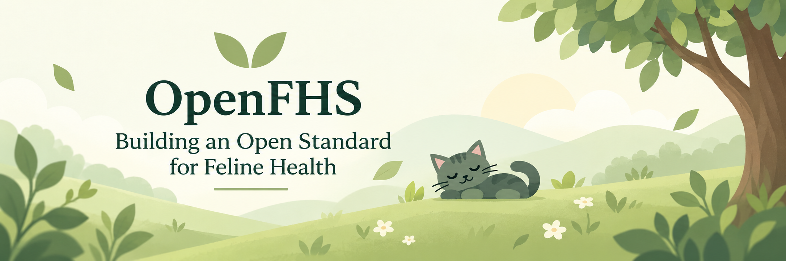
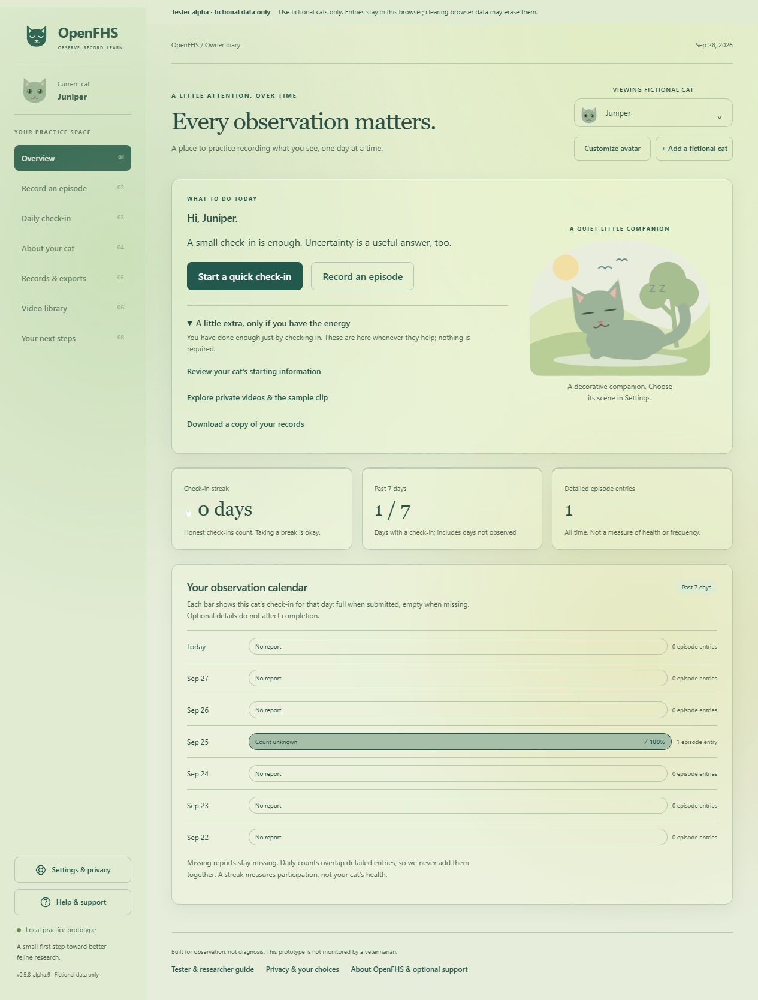

# OpenFHS



**Building an Open Standard for Feline Health.**

OpenFHS began with Feline Hyperesthesia Syndrome and is growing toward an Open Feline Health Standard. It is experimental open-source software for structured feline-health observation, designed to preserve uncertainty, missingness, provenance, corrections and observation coverage.

**[0.5.8-alpha.11 — public usability pre-release](https://github.com/amgedi/OpenFHS/releases/tag/v0.5.8-alpha.11) for about five testers, using fictional data only.** Do not enter real medical or private information. OpenFHS is not diagnostic AI, veterinary advice, a veterinary service, clinically validated software, or a research study.

## Why this exists

Useful observation records should distinguish what someone saw from what they inferred—and what they could not observe. OpenFHS explores approachable ways to keep those distinctions over time, without treating missing reports as healthy days or adding overlapping daily and episode counts together.

## What this alpha does

- Separate fictional cat profiles, starting information, episode entries and daily check-ins.
- Guided questions or full forms, local drafts and correction history.
- Explicit unknown, not-observed, unanswered and zero states.
- Readable bilingual reports, technical JSON/CSV and complete local backups; imports create separate copies.
- Local practice clips, keyboard navigation, reduced motion, themes and a skippable tutorial.
- Spanish, French, Simplified Chinese, Arabic and Turkish **translation previews**, with remaining English fallback.

There are no accounts, cloud database, automatic diary uploads, diagnostic models, clinical recommendations or research enrollment. The optional email-service code is disabled in the public package and must not be deployed as a public backend.



Representative fictional-data screenshot from alpha.9; current themes and some controls have changed.

## Try it safely

Use only invented cats and events. Follow the [15–20 minute tester script](docs/tester-alpha.md) and [feedback template](docs/feedback-template.txt).

**Windows testers:** download `OpenFHS-Offline-0.5.8-alpha.11.exe` from the [official release](https://github.com/amgedi/OpenFHS/releases/tag/v0.5.8-alpha.11). Close older OpenFHS tray apps before launching it. The EXE is unsigned; see the tester instructions if your operating system warns about it. Other platforms can run the source package below. The tester ZIP is a static-hosting package, not an installer. The hosted demo is not currently verified.

From source, with Node.js 22+ and npm:

```sh
npm start
```

Open **http://127.0.0.1:4317**. No dependencies need installing. Keep the terminal open; Ctrl+C stops it. Windows users can use `Start OpenFHS.cmd`. A versioned unsigned Windows launcher is prepared separately; see the tester instructions before running it. Use the versioned GitHub downloads while hosting remains unverified.

## Your local data

Records and drafts stay in browser storage; clips use IndexedDB. Different browsers and app addresses have separate storage. Clearing browser data can erase the diary. Complete backups include drafts and media and are **unencrypted**; ordinary exports omit video bytes. Keep backups and originals privately. Sharing choices are future-use preferences, not active research consent or uploads. [Privacy boundaries](docs/privacy.md) · [Compatibility policy](docs/migration-policy.md)

## Develop and contribute

```sh
npm test
npm run build:public
node preview-public.cjs
```

The last command previews the allowlisted static build at **http://127.0.0.1:4319**, without publishing. On Windows, `./package-release.ps1` builds fresh source/static/EXE artifacts with provenance and checksums; `./scripts/verify-release.ps1` checks them against source. Existing release folders are immutable.

The repository is in **feature freeze**. Help with recovery, accessibility, wording, tests and documentation. Use fictional bug reports; send security concerns privately to **openfhs@gmail.com**. [Contributing](CONTRIBUTING.md) · [Security](SECURITY.md) · [Scope](docs/prototype-scope.md)

## Direction and maturity

The longer-term aim is interoperable observation tools and carefully reviewed feline-health standards, developed with caregivers, veterinarians, researchers and open-source contributors. That is a direction, not an adopted standard or a claim of scientific validation. AI experiments and participant infrastructure are outside this release.

[Data specification](docs/data-specification-v0.1.md) · [Known limitations and release notes](docs/release-notes.md) · [Testing status](docs/release-readiness.md) · [Build instructions](docs/building.md)

[GNU AGPLv3](LICENSE) (AGPL-3.0-only) covers OpenFHS software and documentation and allows commercial use subject to its terms. See [project identity and notices](NOTICE.md). It grants no rights to anyone's private records or videos. Optional [GitHub Sponsors](https://github.com/sponsors/amgedi), [Ko-fi](https://ko-fi.com/openfhs) or [Buy Me a Coffee](https://buymeacoffee.com/openfhs) support does not affect diary features or privacy choices.
